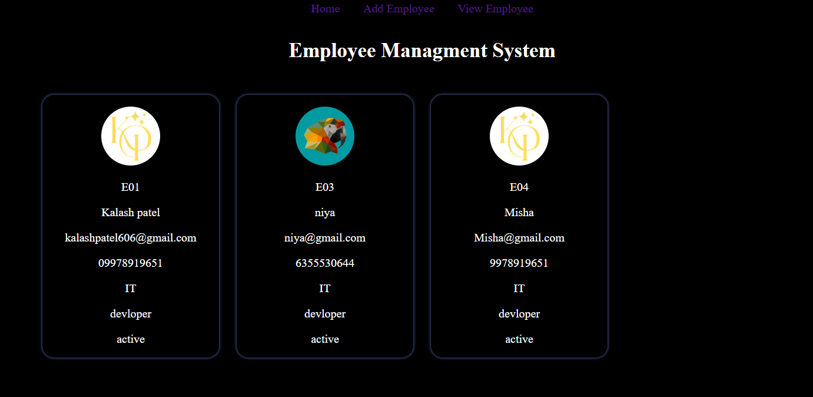
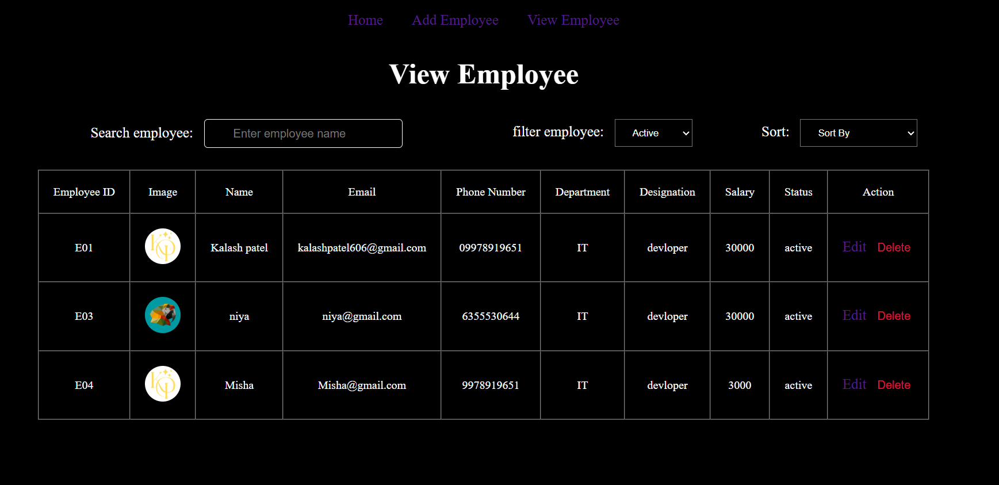
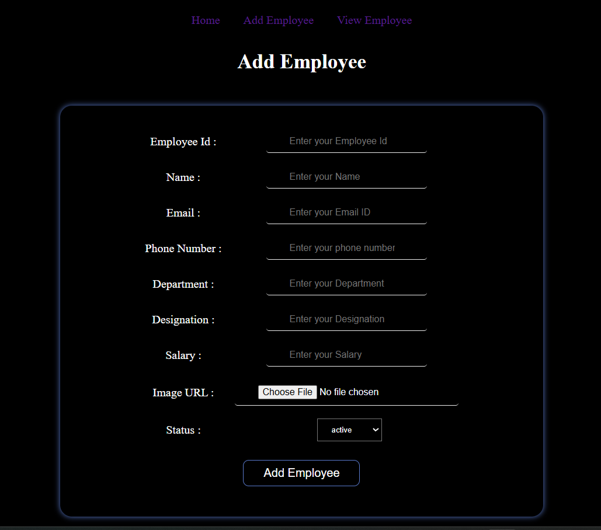
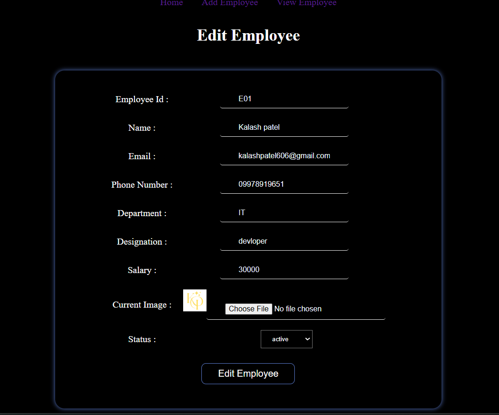

# Employee Management System

A sleek, dark-themed web application designed for efficient CRUD (Create, Read, Update, Delete) management of employee records.

---

## 🚀 Features

* **Employee Dashboard:** A modern grid layout featuring employee profiles with profile pictures.
* **Comprehensive Table View:** A detailed "View Employee" list for easy data management.
* **Full CRUD Support:**
    * **Add:** Form to register new employees with image upload support.
    * **Edit:** Pre-filled forms to update existing employee information.
    * **Delete:** Remove records directly from the management table.
* **Modern UI/UX:** High-contrast dark mode with neon accents and responsive design.

---

## 🛠️ System Overview

The application tracks the following data points for every employee:

| Field | Details |
| :--- | :--- |
| **Employee ID** | Unique system identifier (e.g., E01, E02). |
| **Profile Image** | Support for image URLs or file uploads. |
| **Name** | Full name of the staff member. |
| **Email** | Validated email address. |
| **Department** | Operational unit (e.g., IT, HR, Sales). |
| **Designation** | Professional title (e.g., Developer, Manager). |
| **Salary** | Numerical compensation value. |
| **Status** | Employment state (Active/Inactive). |

---

## 📸 Screenshots

### Dashboard Home
Displays employee cards with a clean, centered layout.

### Data Management Table
The "View Employee" section allows for quick scanning of all database entries with dedicated action buttons for **Edit** and **Delete**.

### Form Interface
Clean input fields with bottom-border styling and dropdowns for status management.

### Edit Data Table

---